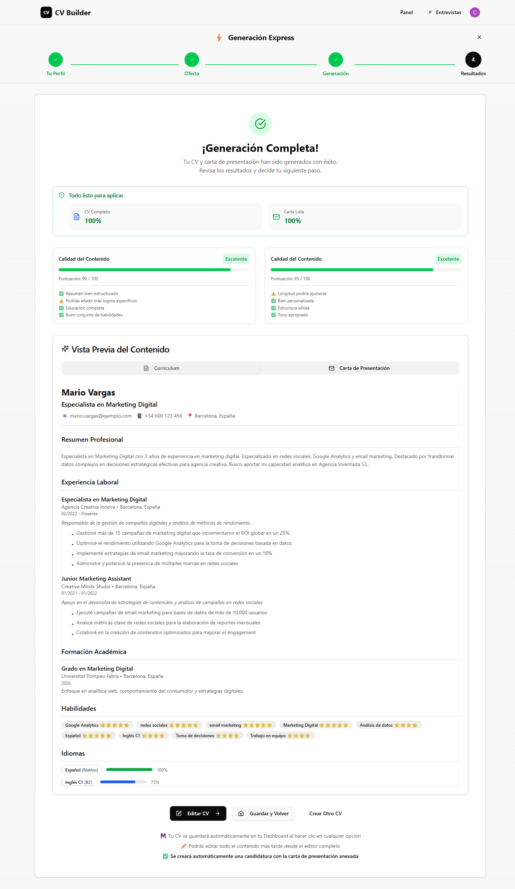
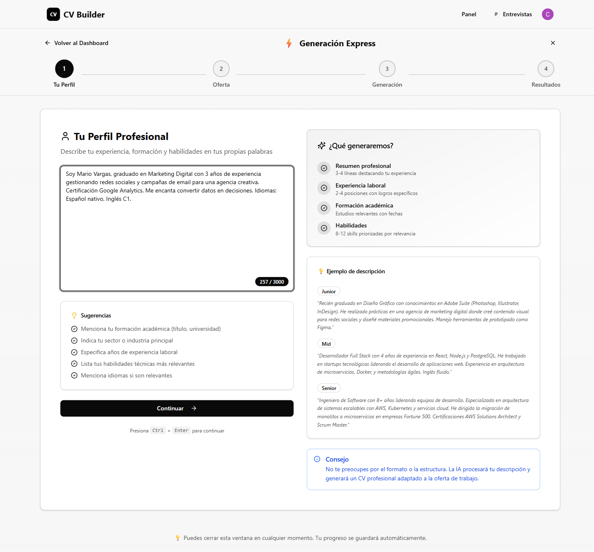
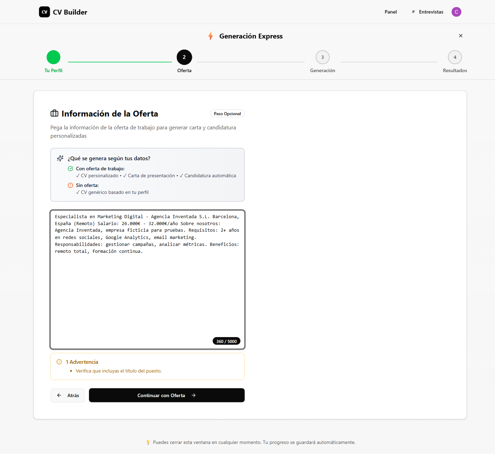
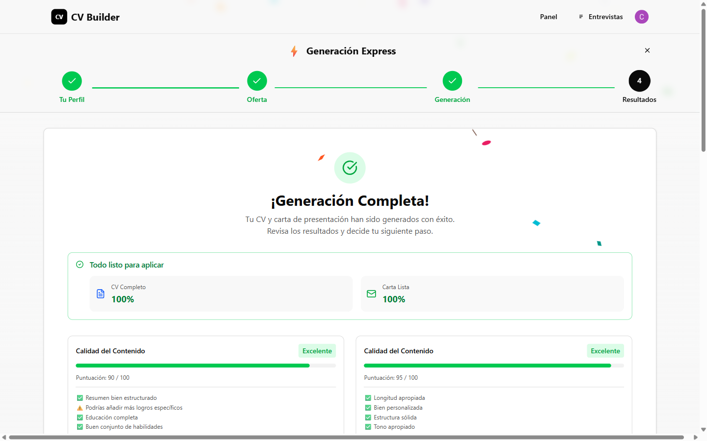
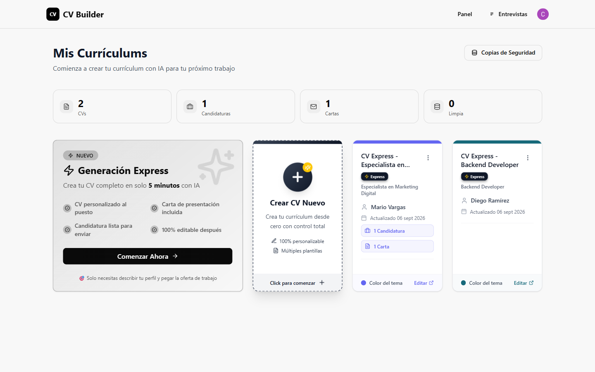
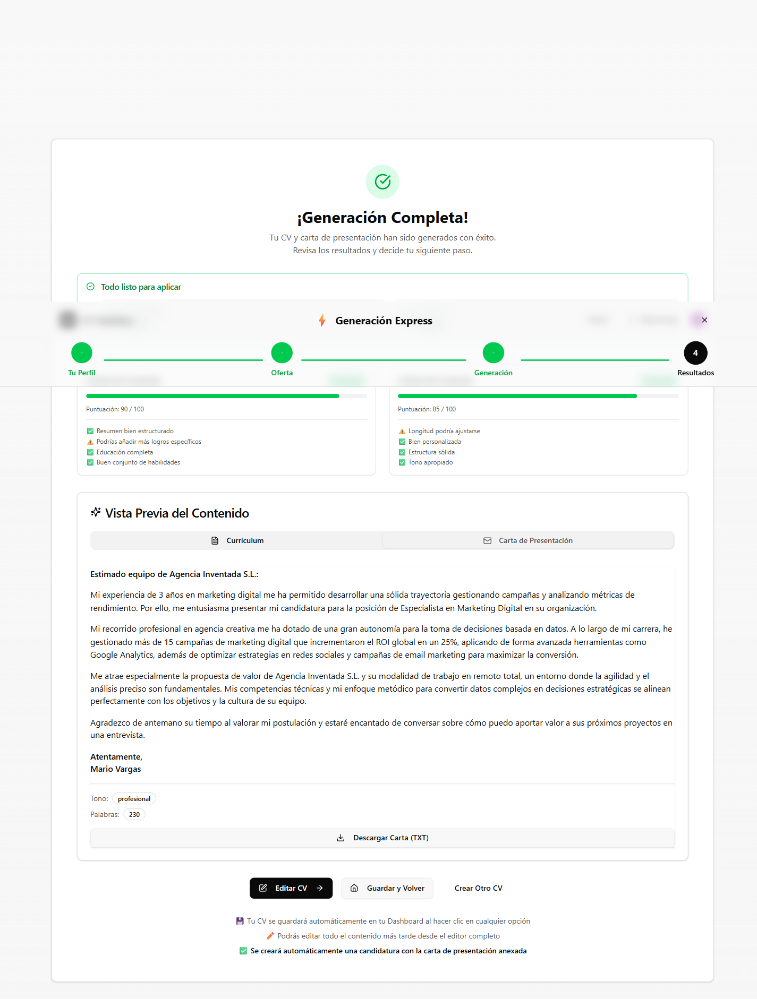
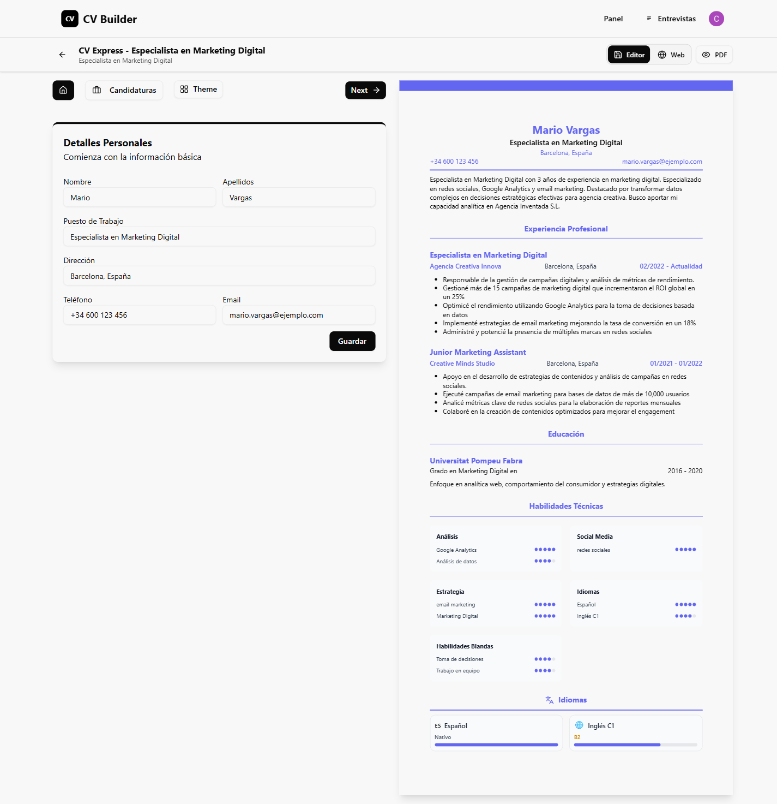
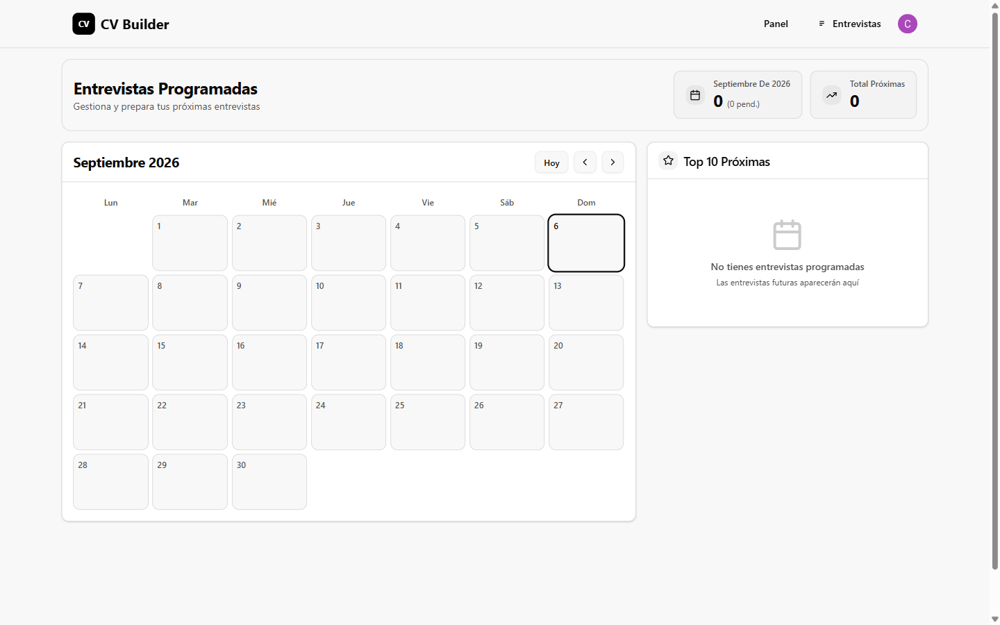
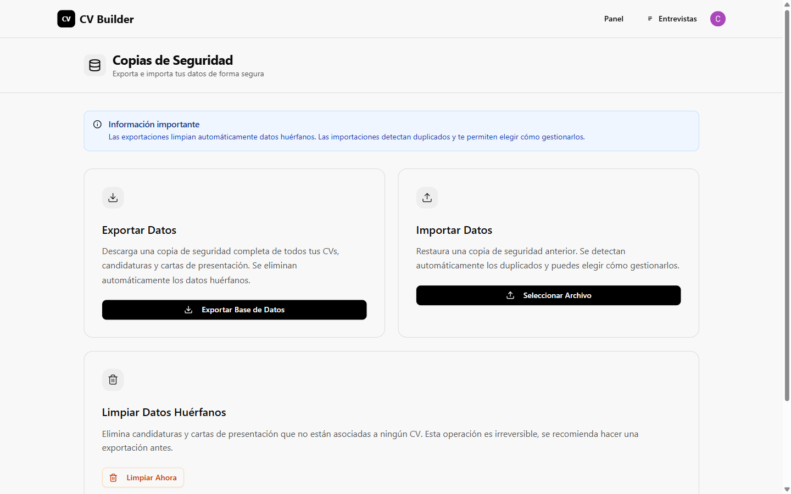
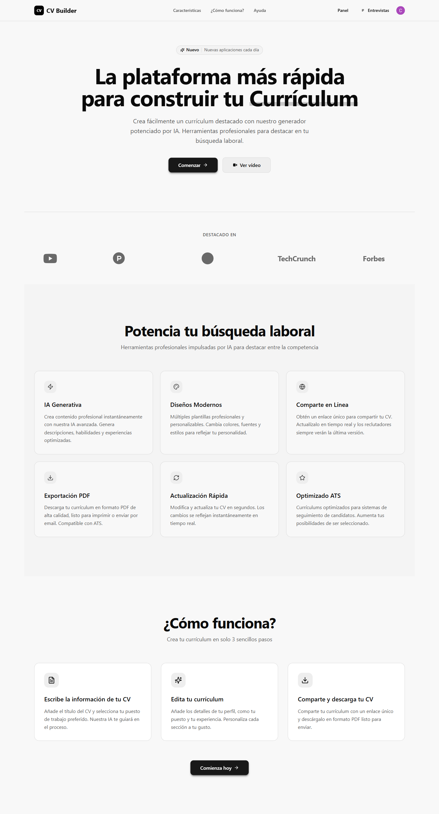

# CV Builder — tu currículum listo en 5 minutos con IA

**CV Builder te crea un currículum profesional aunque partas de una hoja en blanco.**
Describes tu experiencia con tus palabras, pegas la oferta de trabajo que te gusta
y la inteligencia artificial redacta tu CV, tu carta de presentación y deja la
candidatura preparada. Sin plantillas vacías que rellenar a mano y sin saber diseñar.



## Usarlo es así de fácil

1. **Cuenta tu historia.** Escribes tu experiencia, formación y habilidades tal
   como te salga, sin preocuparte del formato.
2. **Pega la oferta.** Copias la oferta de LinkedIn, InfoJobs o Indeed y la IA
   detecta sola la empresa, el puesto, el salario y los requisitos.
3. **Mira cómo lo crea.** Ves el progreso en directo: analiza tu perfil, extrae
   la oferta, redacta el CV y escribe la carta.
4. **Recibe y decide.** Obtienes el CV puntuado, la carta personalizada y la
   candidatura lista. Lo editas, lo descargas o lo compartes con un enlace.







## Tus CVs, todos en un panel

Cada currículum vive en tu panel con sus candidaturas, sus cartas y su próxima
entrevista a la vista. De un vistazo sabes en qué punto está cada búsqueda
de trabajo.



## La carta se escribe sola

Con la oferta pegada, la aplicación redacta una carta de presentación a tu medida:
menciona la empresa, el puesto y tus puntos fuertes con un tono profesional.
La puedes descargar o editar.



## Todo se puede retocar a mano

Cada CV se abre en un editor con el formulario a la izquierda y el resultado a
la derecha: lo que cambias se ve al momento. Colores, secciones, textos, idiomas
con nivel… y una pestaña aparte para ver cómo queda tu CV como página web.



## Qué sabe hacer, en palabras normales

**Crear con inteligencia artificial**
- Generación express en 4 pasos: perfil, oferta, generación y resultados.
- Entiende tu descripción libre y la convierte en datos ordenados (experiencia,
  sector, nivel, habilidades, idiomas con su nivel).
- Lee la oferta pegada y saca sola empresa, puesto, ubicación, salario,
  requisitos y habilidades pedidas.
- Redacta el CV completo: resumen profesional, experiencia con logros,
  formación, habilidades con estrellas e idiomas con barra de nivel.
- Escribe la carta de presentación personalizada para esa empresa y ese puesto.
- Crea la candidatura automáticamente con la carta anexada.
- Te puntúa el resultado (CV y carta por separado) y te dice qué mejorar.

**Editar sin límites**
- Editor con vista previa en vivo: formulario a un lado, CV al otro.
- Secciones de datos personales, resumen, experiencia, formación, habilidades
  e idiomas.
- La IA te ayuda a redactar y mejorar resúmenes, textos y habilidades, y te
  sugiere habilidades por categorías.
- Varios colores y estilos para el CV, más vista de página web.
- Crear CVs desde cero con control total, con datos de ejemplo para empezar.

**Llevar tus candidaturas**
- Cada CV tiene sus candidaturas: empresa, puesto, ubicación, web de la oferta,
  teléfono de contacto, estado, fecha de entrevista y enlace de la entrevista.
- Buscador y filtros por estado para encontrarlas rápido.
- Estadísticas por CV: cuántas candidaturas, cuántas cartas y cuál es tu
  próxima entrevista.
- Carta de presentación propia por candidatura, generada o escrita a mano,
  descargable en TXT.

**Preparar entrevistas**
- Simulacros de entrevista generados por IA para cada candidatura, con nivel
  a elegir y preguntas técnicas y de comportamiento.
- Calendario mensual con todas tus entrevistas, lista de próximas citas y
  detalle de cada día.

**Compartir y descargar**
- Tu CV como página web pública con enlace único: lo actualizas y quien tenga
  el enlace siempre ve la última versión.
- Enlace público en PDF con descarga automática, y contador de visitas para
  saber si lo están viendo.
- Descarga tu CV en PDF de alta calidad, listo para imprimir o enviar.

**Tus datos, a salvo**
- Entrada con cuenta (Google, GitHub o email) para que cada persona vea solo
  lo suyo.
- Todo se guarda en tu propio navegador, funciona sin servidor y sin internet
  para tus datos.
- Copias de seguridad con un clic: exportas todo a un archivo e importas para
  recuperar, con estadísticas de lo que tienes guardado.

**Más pantallas**







## Ponerlo en marcha (5 minutos)

```bash
git clone https://github.com/cursospotiapp/ai-resume-builder.git
cd ai-resume-builder
npm install
```

Copia la plantilla de configuración y rellena tus claves:

```bash
copy .env.example .env
```

Abre el `.env` y pon tus 3 valores:

| Clave | Dónde se consigue (gratis) |
|---|---|
| `VITE_GOOGLE_GEMINI_AI_API_KEY` | En [Google AI Studio](https://aistudio.google.com/apikey): entra con tu cuenta de Google, pulsa *Create API key* y cópiala. Es la que permite a la IA redactar. |
| `VITE_GOOGLE_GEMINI_MODEL` | El modelo a usar, por ejemplo `gemini-flash-lite-latest`. Ya viene puesto en la plantilla. |
| `VITE_CLERK_PUBLISHABLE_KEY` | En [Clerk](https://dashboard.clerk.com): crea cuenta, crea una aplicación y copia la *Publishable Key* (empieza por `pk_test_`). Es pública y solo sirve para el login. |

Arranca y abre `http://localhost:5173`:

```bash
npm run dev
```

Las claves viven solo en tu `.env`, que nunca se sube al repositorio (está en
el `.gitignore`). Sin ellas la aplicación arranca pero la IA y el login no funcionan.

## Con qué está hecho (para perfiles técnicos)

React 18 + Vite, Tailwind CSS 4, Google Gemini (`@google/generative-ai`),
login con Clerk, base de datos local IndexedDB con Dexie (capa propia
`LocalDatabase`, sin backend), React Router, componentes Radix, PDF con jsPDF +
html2canvas e imagen con html-to-image.
